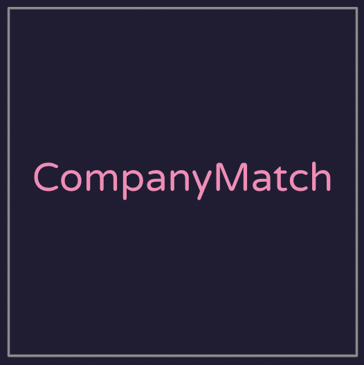
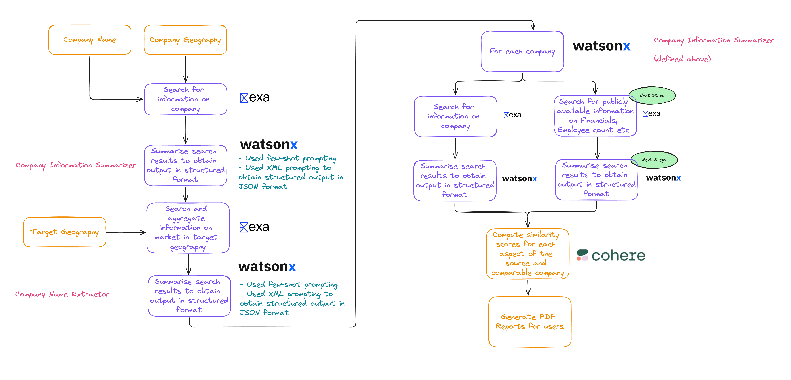

# CompanyMatch

CompanyMatch is an AI-powered tool that automates company research and competitor analysis for sales and investment professionals. It was developed as a submission for the WatsonX Lablab.ai hackathon.

## Problem Statement

Finding similar companies in different geographies is a time-intensive and overwhelming process. Professionals such as investment analysts, business development managers, and strategy consultants face challenges in:

- Identifying potential partners/customers
- Understanding new market landscapes
- Providing data-driven insights across industries
- Meeting tight deadlines for comprehensive analysis
- Handling time pressure for multiple company analyses
- Identifying truly comparable companies

## Solution

CompanyMatch leverages AI-led automation for company discovery and analysis. The solution workflow includes:

1. Programmatic search with Exa
2. Intelligent data processing using WatsonX
3. Similarity scoring using Cohere's embedding models

### Solution Flow



### Key Technologies

- **Exa**: Used for neural search capabilities to constrain search results to the most semantically relevant pages.
- **IBM Watson (watsonx)**: Utilized the ```ibm/granite-13b-chat-v2``` model with XML prompting for structured output.
- **Cohere**: Employed Cohere's embedding models to provide preliminary similarity scores of comparable companies.

## Features

- Specify a company name and target geography
- Get a report of comparable companies in other geographies
- AI-driven automation for company discovery and analysis
- Similarity scoring for quick judgments on deep-dive candidates

## Value Proposition

1. Significantly enhanced productivity
2. Reduced risk of overlooking crucial information
3. More time for strategic decision-making
4. Consistent and structured research output

## Future Roadmap

- Integration of proprietary financial data
- Investor data integration
- LinkedIn connection highlighting
- Sales database integration
- Customizable AI models
- Real-time market updates

## Acknowledgments

This project was developed as part of the IBM WatsonX Lablab.ai hackathon.

## Contact

- [Avinaash Anand K](https://www.linkedin.com/in/avinaashanand/)